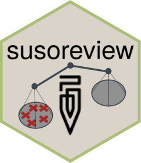

<!-- README.md is generated from README.Rmd. Please edit that file -->

```{r, include = FALSE}
knitr::opts_chunk$set(
  collapse = TRUE,
  eval = FALSE,  
  comment = "#>",
  fig.path = "man/figures/README-",
  out.width = "100%"
)
```

# susoreview 

<!-- badges: start -->
<!-- badges: end -->

The goal of susoreview is to offer tools for the process of automating review and rejection of interviews. The tools span the full pipeline of that process:

- Creating attributes, developed from microdata and used for identifying issues;
- Creating issues, devised from one or more attribute or directly from serious flaws in the data; and
- Executing reject/review workflow, by:
  + adding issues based on interview metadata (e.g., number of unanswered questions)
  + checking for relevant comments that require review before rejection
  + flagging persistent issues that require actions outside of rejection
  + constructing rejection messages from all issues relevant for an interview
  + posting comments to specific questions of the questionnaire
  + rejecting the interviews via the appropriate API endpoint as a function of each interview's status

## Installation

The package is not yet on CRAN, but can be installed via the following command:

``` r
# install.packages("devtools")
devtools::install_github("arthur-shaw/susoreview")
```

## Usage

### Scope

- Create attributes
- Create issues
- Execute reject/review workflow

### Create attributes

```{r, include=FALSE}
extract_attribute
create_attribute

count_vars
count_list
any_vars

count_obs
any_obs
sum_vals
```

### Create issues

```{r, include=FALSE}
create_issue
make_issue
make_issue_in_roster
```

### Execute reject/review workflow

```{r, include=FALSE}
add_issue_if_unanswered
add_issues_for_suso_errors
check_for_comments
decide_action
add_rejection_msgs
flag_persistent_issues
post_comments
reject_interview
```
